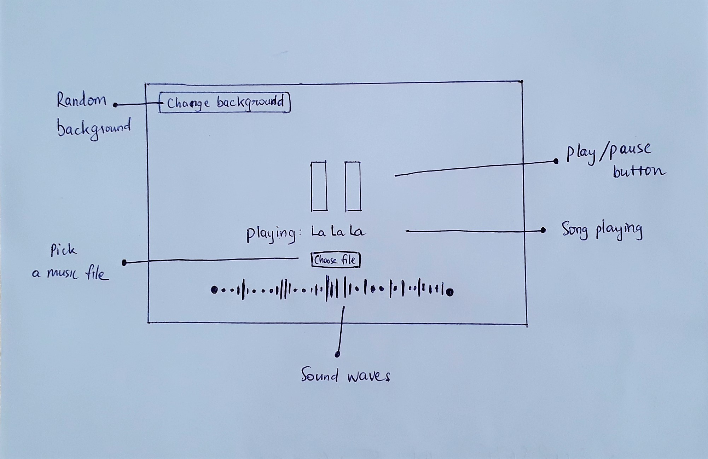
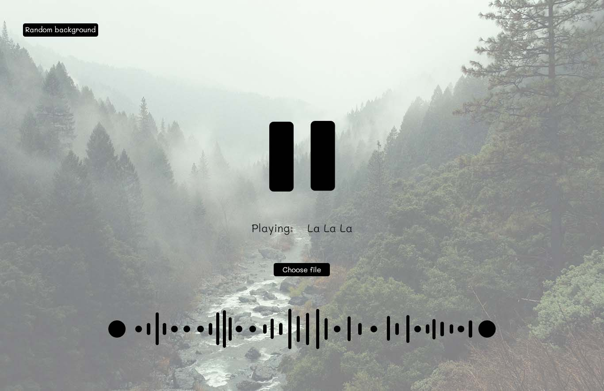

# Soundwave Music Player

From the love with music and visualization, I came up with this idea to build a minimal music player with dynamic sound waves :notes:

### Project details

**This is my initial sketch** :pencil2:

**Then I used Photoshop to turn it to this**

A high fidelity mockup

 
 

**And the final result? View it live here**
https://viet-v.github.io/soundwave-music-player/

### Features
- Choose an audio file from your computer.
- Click Play button, SMP will analyze your audio frequencies and visualize them by sound waves.
- While listening to music, you can click `Random Background` at top left corner to change the view.

### Languages and tools
- HTML, CSS and vanilla JavaScript.
- Visual Studio Code and Photoshop CC 2022.

#### Project idea, design and code by @viet-v
